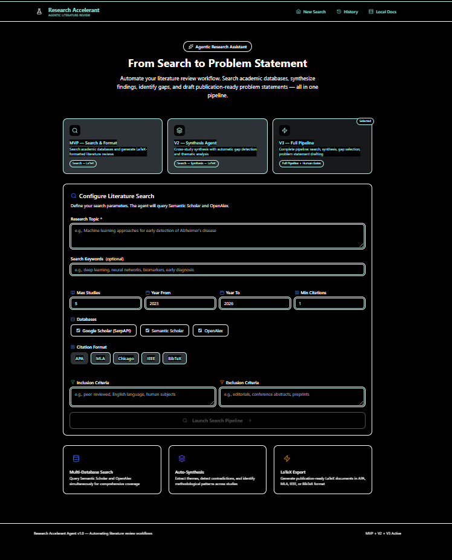
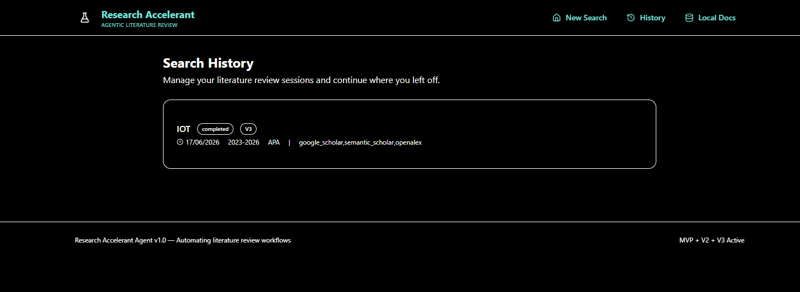
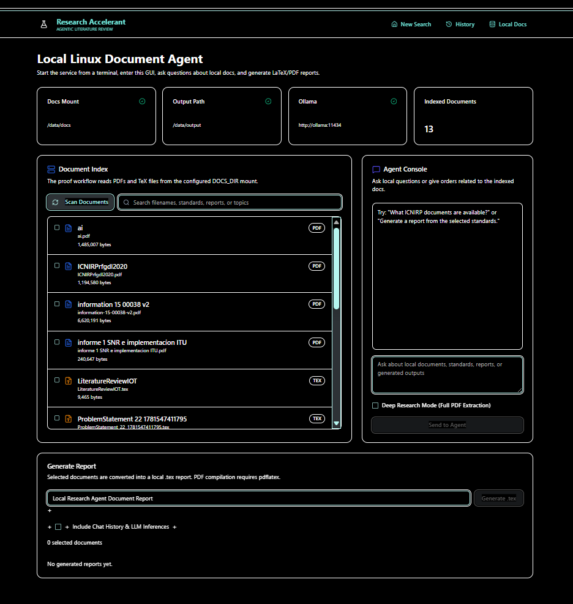
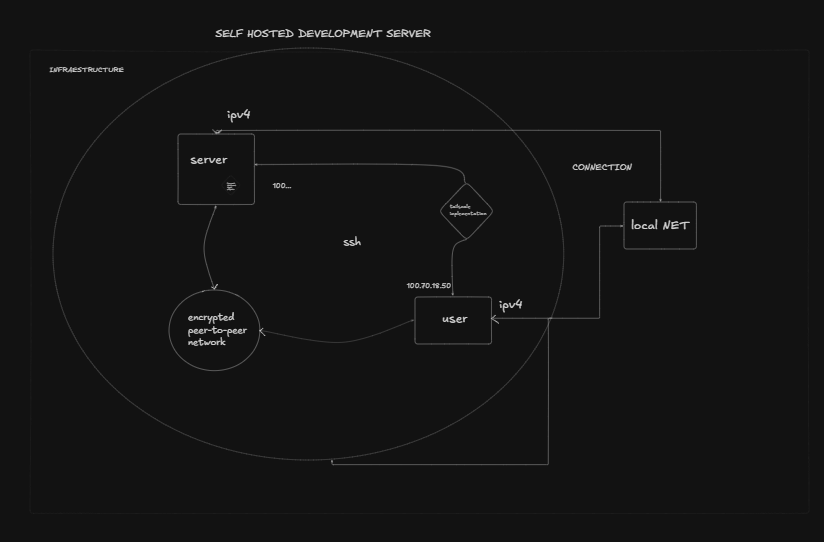
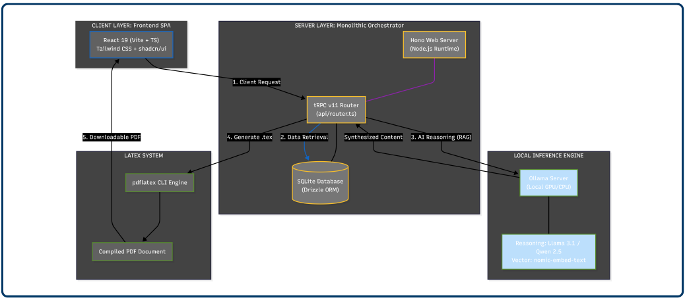

# GCPDS - Research Accelerant Agent 


## End-points

> Main page - Dashboard




> History page - sessions archive 



> Docs page - local database and RAG 



---

> **Technical Introduction:** For a detailed breakdown of the agent's architecture and capabilities, see the [technical and problem statement as introduction](tech.md).

## Research Accelerant Agent & Self-Hosted Hub

_The **GCPDS Research Hub** is a high-performance development environment and AI-powered research assistant._

This project transforms a standard server into a dedicated "Self-Hosted Research Hub" designed for autonomous literature review and automated deployment.

---

##  The Vision: Why a Self-Hosted Research Server?

In professional research and DevSecOps, your local machine shouldn't be a bottleneck. Moving from manual scripts to a **dedicated server service** provides:
- **24/7 Availability:** Your research pipelines (Search → Extraction → Synthesis) run in the background without needing your laptop open.
- **Computational Offloading:** Heavy AI tasks (Ollama/Llama 3.1) and PDF indexing are handled by server-grade hardware/GPU.
- **Centralized Source of Truth:** A "Data Lake" for PDFs and datasets that doesn't bloat your local Git repositories.
- **Professionalism:** Deploying tools as **Linux Services (`systemd`)** ensures resilience, auto-restarts, and a clean CLI interface (`gcpds start`).

---

##  Quick Access Dashboards

If you are connected to the **University Network** or **Tailscale**, you can access the hub directly:

| Service | Local Link | Status |
| :--- | :--- | :--- |
| **Research Agent UI VIA TAILSCALE** | [http://100.70.18.50:3000/docs](http://100.70.18.50:3000/docs) | [](http://100.x.y.z:3000) |
| **Research Agent UI LOCAL** | [http://192.168.0.136:3000](http://192.168.0.104:3000) |  |

> **Note:** Use `user@local.local` instead of the IP if Avahi is active on your client.

> **Auth:** we only got two users: `serveradmin/coworker@local.local`


## First Prototype Flow


1. Made a reserach or upload a file into the local DB. 
1.1. Open `Local Docs`.
2. Click `Scan PDFs`.
3. Search by file name, standard number, report name, acronym, or topic.
4. Ask questions in `Agent Console`.
5. Select documents.
5.1 Ask specific questions about the selected document. 
6. Generate a `.tex` report.
7. Compile the `.tex` report to `.pdf`.

---

## Infrastructure & Connectivity

The server is designed to operate within complex networking environments (like University campuses) using a hybrid access model.



### 1. The University Network (Local Access)
The server connects to the University WiFi/Ethernet. 
- **Local Discovery:** Uses `Avahi-daemon` for `.local` resolution.
- **Direct SSH:** Access via `ssh server.admin` or `ssh server.coworker` when on the same network.
- **Resilience:** If the network restricts external VPNs, local SSH remains the primary low-latency connection.

### 2. Hybrid Remote Control (Tailscale & Hotspots)
For work outside the lab or when University ports are blocked:
- **Tailscale:** A secure mesh VPN that bypasses NAT and firewalls, allowing you to access the Agent and your files from anywhere in the world.
- **Temporal Hotspots:** The server supports connection via mobile hotspots as a "Bridge" for initial setup or remote maintenance when primary WiFi is unavailable.

---

##  The Research Accelerant Agent (v0.2-1.0)

The crown jewel of this hub is the **Research Accelerant Agent**, an AI-powered, full-stack academic literature review assistant. It orchestrates a pipeline of intelligent agents to automate the heavy lifting of academic research.

### Core Pipeline & Capability
| Version | Capability | Description |
|---------|------------|-------------|
| **V1 (MVP)** | **Search & Extraction** | Queries Semantic Scholar and OpenAlex. Parses metadata, abstracts, methodology, and key findings. |
| **V2** | **Cross-Study Synthesis** | Identifies overarching themes, recurring gaps, and methodological patterns across studies. |
| **V3** | **Problem Statement** | Crafts formal research gap statements with stakeholder analysis and consequences of inaction. |
| **ALL** | **LaTeX Engine** | Compiles findings into publication-ready documents using professional templates and `pdflatex`. |

### Key Features
- **Real-time Session Tracking:** Monitor progress from `pending` → `searching` → `extracting` → `synthesizing` → `drafting` → `completed`.
- **Local Document Agent:** Index, review, and compile local PDFs and `.tex` reports directly from the hub's storage.
- **Ollama Integration:** Uses local LLMs (Llama 3.1) to "read" your PDFs and answer questions based on the actual content.
- **Human-in-the-loop:** Review, approve, or reject generated problem statements before export.

---

## Tech Stack & Architecture

The application is built as a modern, type-safe monolith designed for high performance and developer productivity.

### Core Tech Stack
| Layer | Technology |
|-------|------------|
| **Frontend** | React 19, TypeScript, Vite, Tailwind CSS, shadcn/ui |
| **Backend** | Hono (Node.js), tRPC v11, SuperJSON |
| **Database** | MySQL/Postgres with Drizzle ORM |
| **AI** | Ollama (Llama 3.1) + NVIDIA Container Toolkit |
| **OS** | Ubuntu Server 24.04 LTS + CasaOS Dashboard |

### System Architecture
```
┌─────────────────┐
│   React SPA     │  (Vite, React Router, Tailwind, shadcn/ui)
│   src/pages/    │
└────────┬────────┘
         │ tRPC over HTTP (/api/trpc)
         ▼
┌─────────────────┐
│   Hono Server   │  (Node.js HTTP framework)
│   api/boot.ts   │
└────────┬────────┘
         │
         ▼
┌─────────────────────────────────────────────┐
│  tRPC Router (api/router.ts)                │
│  ├── search      → academic-search.ts       │
│  ├── synthesis   → synthesis-engine.ts      │
│  ├── statement   → problem statement gen    │
│  ├── latex       → latex-generator.ts       │
│  └── docs        → local-docs.ts            │
└─────────────────────────────────────────────┘
```


   * Servidor Web (Backend): Hono (https://hono.dev/) (un framework de Node.js ultrarrápido).
   * Protocolo de Comunicación: tRPC v11 (https://trpc.io/) (para tipos seguros entre frontend y backend).
   * Validación de Datos: Zod (https://zod.dev/) (Es el equivalente en TypeScript a Pydantic).
   * Base de Datos / ORM: Drizzle ORM con SQLite/PostgreSQL.
   * Orquestación de IA: Implementación nativa en TypeScript en advanced-research-pipeline.ts que consume Ollama (Llama 3.1) vía API REST.


---

## Database Schema

The schema (managed by Drizzle ORM) centers on five core entities that manage the research lifecycle:

| Table | Purpose |
|-------|---------|
| `search_sessions` | Core entity for each literature review request (topic, filters, status, version). |
| `papers` | Individual papers retrieved from academic APIs (metadata, abstracts, findings, methodology). |
| `synthesis_results` | Cross-study synthesis and gap analysis output (V2). |
| `problem_statements` | Final problem statement with optional human feedback and LaTeX output (V3). |
| `latex_outputs` | Generated LaTeX documents and compiled PDF URLs. |

---


## Unified System Integration (API)



## Service Management

The agent is implemented as a **Global Linux Service**. You can manage it from any terminal via the `gcpds` CLI:

```bash
gcpds agent start      # Starts the API and Web UI
gcpds agent stop       # Stops the service
gcpds dashboard        # Provides the local/remote URL for the GUI
```

---

## Getting Started (Local Setup Guide)

Follow these steps to deploy the Research Hub and Agent on your local server or development machine.

### 1. Prerequisites
- **Node.js** 20+ (LTS recommended)
- **MySQL/Postgres** database
- **Ollama** installed (for local LLM features)
- **pdflatex** (for PDF compilation)

### 2. Installation
```bash
# Clone the repository
git clone https://github.com/Macreat/ResearchAccelerantAgent.git
cd ResearchAccelerantAgent/app

# Install dependencies
npm install

# Configure environment
cp .env.example .env
# Edit .env with your DATABASE_URL and API keys
```

### 3. Database & Services
```bash
# Push the schema to your database
npm run db:push

# Start the development environment (Unified HMR)
npm run dev
```
The application will be available at `http://localhost:3000`.

---


## Project Structure

```
ResearchAccelerantAgent/
├── app/                          # Full-stack web application
│   ├── src/                      # React frontend (pages, components, providers)
│   ├── api/                      # Hono + tRPC backend (routers, services, boot)
│   ├── db/                       # Database layer (schema, migrations)
│   └── contracts/                # Shared types (frontend ↔ backend)
└── content/                      # Media and infrastructure diagrams
```


---

 _*Maintained by the GCPDS Team. Built for the future of automated academic research.*_

---


_v0.2-1.0 Prototype Stable._