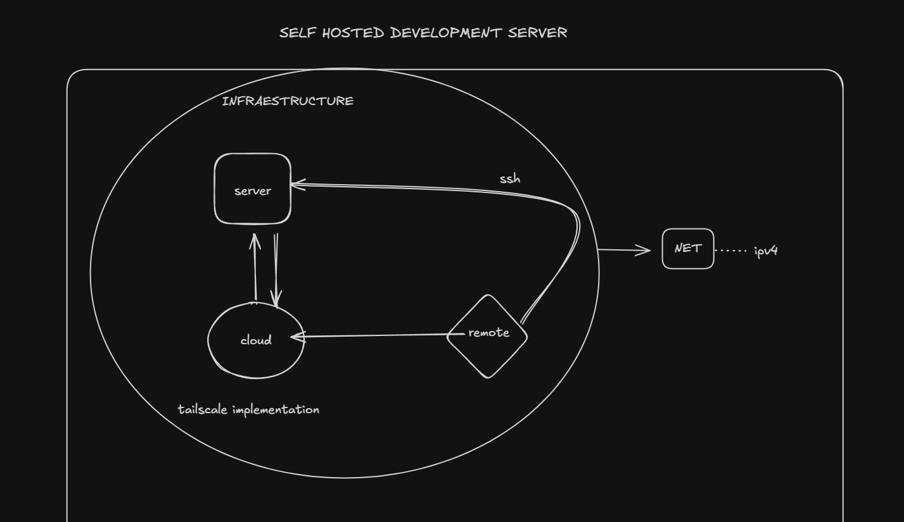

# GCPDS 

## Research Accelerant Agent & Self-Hosted Hub

_The **GCPDS Research Hub**, it is a high-performance development environment and AI-powered research assistant._

This project transforms a standard server into a dedicated "Self-Hosted Research Hub" designed for autonomous literature review and automated deployment.

---

##  The Vision: Why a Self-Hosted Research Server?

In professional research and DevSecOps, your local machine shouldn't be a bottleneck. Moving from manual scripts to a **dedicated server service** provides:
- **24/7 Availability:** Your research pipelines (Search → Extraction → Synthesis) run in the background without needing your laptop open.
- **Computational Offloading:** Heavy AI tasks (Ollama/Llama 3.1) and PDF indexing are handled by server-grade hardware/GPU.
- **Centralized Source of Truth:** A "Data Lake" for PDFs and datasets that doesn't bloat your local Git repositories.
- **Professionalism:** Deploying tools as **Linux Services (`systemd`)** ensures resilience, auto-restarts, and a clean CLI interface (`gcpds start`).

---

##  Quick Access Dashboards

If you are connected to the **University Network** or **Tailscale**, you can access the hub directly:

    - If you wanna connect via TAILSCALE, there are some features to update.

| **CasaOS Dashboard** | [http://100.70.18.50/#/](http://100.70.18.50/#/) | [](http://100.x.y.z:3000) | 

| **Research Agent UI** | [http://100.70.18.50:3000/docs](http://100.70.18.50:3000/docs) | [](http://100.x.y.z:3000) |


| Service | Local Link | Status |
| :--- | :--- | :--- |
| **Research Agent UI** | [http://192.168.0.104:3000](http://192.168.0.104:3000) |  |
| **CasaOS Dashboard** | [http://192.168.0.104](http://192.168.0.104) |  |

> **Note:** Use `local.local` instead of the IP if Avahi is active on your client.

---

## Infrastructure & Connectivity

The server is designed to operate within complex networking environments (like University campuses) using a hybrid access model.



### 1. The University Network (Local Access)
The server connects to the University WiFi/Ethernet. 
- **Local Discovery:** Uses `Avahi-daemon` for `.local` resolution.
- **Direct SSH:** Access via `ssh server.admin` or `ssh server.coworker` when on the same network.
- **Resilience:** If the network restricts external VPNs, local SSH remains the primary low-latency connection.

### 2. Hybrid Remote Control (Tailscale & Hotspots)
For work outside the lab or when University ports are blocked:
- **Tailscale:** A secure mesh VPN that bypasses NAT and firewalls, allowing you to access the Agent and your files from anywhere in the world.
- **Temporal Hotspots:** The server supports connection via mobile hotspots as a "Bridge" for initial setup or remote maintenance when primary WiFi is unavailable.

---

##  The Research Accelerant Agent (v0.2-1.0)


The crown jewel of this hub is the **Research Accelerant Agent**, a full-stack academic assistant.

### Core Pipeline
1. **Search Agent:** Queries Semantic Scholar and OpenAlex for top-tier papers.
2. **Extraction Agent:** Parses metadata and abstracts directly from local/remote sources.
3. **Ollama Integration:** Uses local LLMs to "read" your PDFs and answer questions based on the actual content.
4. **LaTeX Engine:** Compiles findings into publication-ready documents using professional `tcolorbox` templates.

### Service-Oriented Architecture
The agent is moving from a prototype to a **Global Linux Service**. Once onboarded, you can manage it from any terminal:
```bash
gcpds agent start      # Starts the API and Web UI
gcpds dashboard        # Provides the local/remote URL for the GUI
```

---

## Future Roadmap: Automation & CI/CD

To transition from a personal lab to a collaborative research environment, we are implementing:

### GitHub Actions (Self-Hosted)
- **Automated Testing:** Every push to the repo triggers the server to run `vitest` and `eslint` to ensure the Agent stays stable.
- **CI/CD Pipelines:** Automatic deployment of new Agent versions to the local Docker or Systemd environment.
- **Collaborative Runners:** The server acts as a dedicated worker for GCPDS GitHub repositories, accelerating the group's overall development speed.

---

## Tech Stack Highlights
- **Backend:** Hono, tRPC v11, Node.js.
- **Frontend:** React 19, Tailwind CSS, shadcn/ui.
- **Database:** MySQL/Postgres with Drizzle ORM.
- **AI:** Ollama (Llama 3.1) + NVIDIA Container Toolkit.
- **OS:** Ubuntu Server 24.04 LTS + CasaOS Dashboard.

_given us this final prototype as v0.2_ 


---
*Maintained by the GCPDS Team. Built for the future of automated academic research.*
